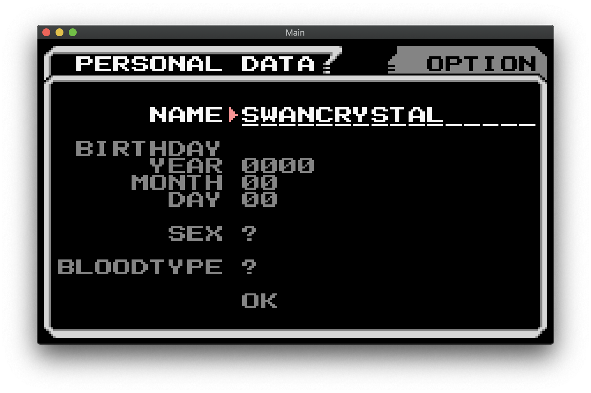
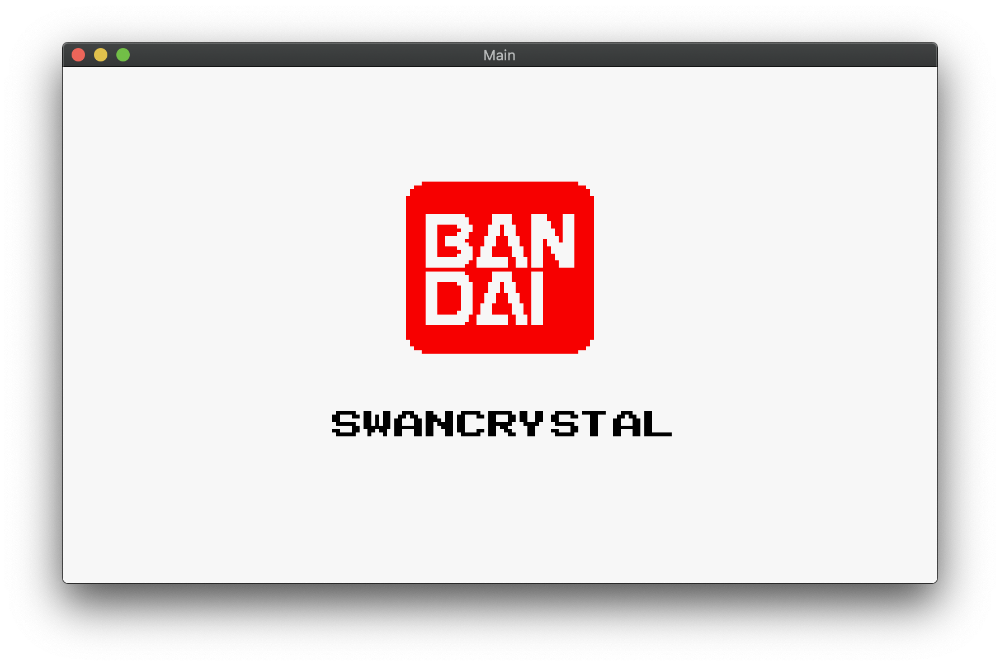
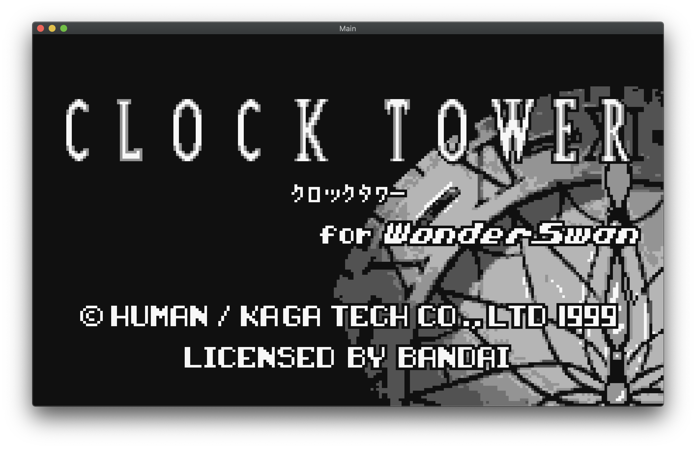
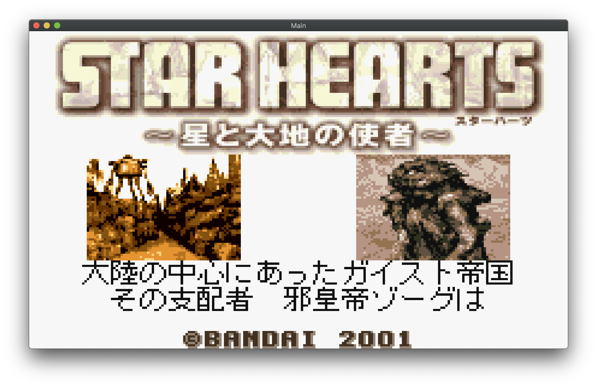
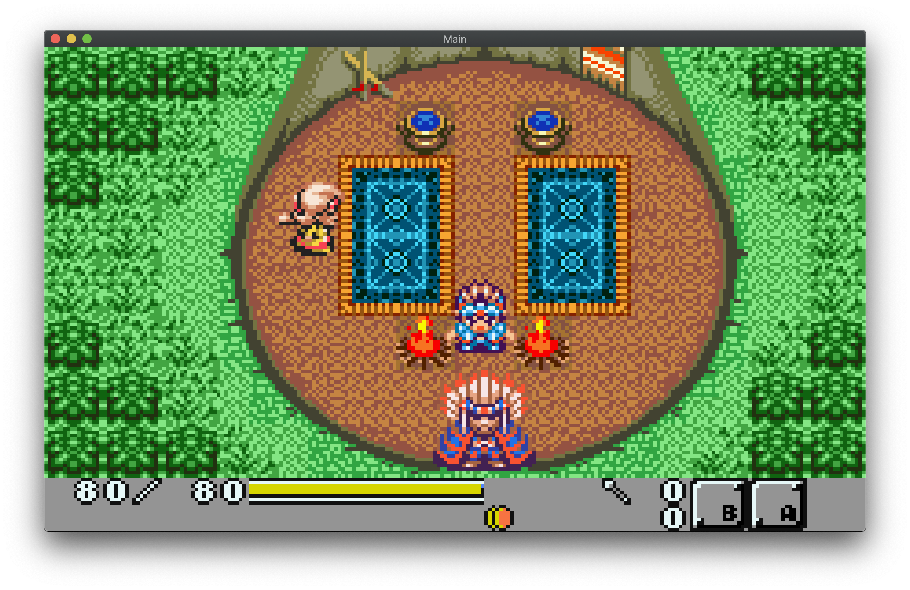

NewOswan *(name likely to change)*
==================================


### What is this project?
NewOswan is a WonderSwan emulator originally based on oswan-unix and heavily modified to be more accurate and better 
hardware support. 

### I don't care about the blabla, just show me the thing running

Ok ok, here are some screenshots:

Using a Swan Crystal boot rom:


Wonderswan Crystal boot splash:


Clock Tower:


Star Hearts:



### What's different from oswan-unix?

A couple of things:

- NewOswan do properly support the internal EEPROM and cartridge EEPROM. 
  The original version was based in improper and innacurate hardware documentation and was accessing and storing the
  information in an incorrect way.
- NewOswan support the internal bootrom of all the three model of the WonderSwan.
- NewOswan also provide stub version for the bootrom if you don't own the original console, you can still
  use the emulator withtout copyright infreigement. (no copyrighted materiel is included with the emulator for obvious
  reasons)
- NewOswan use OpenGL instead of SDL
- Sound is currently not supported
- NewOswan is currently not meant as a fully operational emulator as this project mostly started as a way to test game
  and the original hardware. Still the idea is to make it overtime as accurate as possible
- It is now pure C (the original code was based on a C project with some unneeded C++ here and there)
- 64-Bit clean, the original code was making assumption on some type size that can break on a 64bit system
- Build and run on Mac OS X, Linux x86 and ARM, and probably more systems.
- Some crude debugging tools that can only be enabled at compile time
- Tons of fancy logs in the console! Like:
```
IEEP: RA:143F RD:0006 A:03F C:WRI - Write? Yes : 0006
IEEP: RA:1440 RD:0101 A:040 C:WRI - Write? Yes : 0101
IEEP: RA:1441 RD:0016 A:041 C:WRI - Write? Yes : 0016
IEEP: RA:1442 RD:0000 A:042 C:WRI - Write? Yes : 0000
WriteIO(6A, 00) [F000:0018h];
WriteIO(6B, 00) [F000:0018h];
Icons           H    
WriteIO(6A, 00) [F000:0018h];
WriteIO(6B, 00) [F000:0018h];
```
- And many more thing I probably forgot about as this project was originally not version managed as it was just a crude
  hack on the original code and are not in the logs.

### Futur plans
- Complete refactor of the code.
- Add a proper CPU debugger
- Add other nice debugging tool like the GPU status and other things that could be needed. Acheiving the level of the tools
  provided by the NES emulator [Mesen](https://www.mesen.ca) would be nice.
- Being able to rotate the screen
- Maybe being able to change the game at runtime instead of start time
- Full Audio support


### The boot rom stubs
You can find the source and file in the `irom_stub` folder.
They are identical and for now provide only the logic to boot a cart. There is no bootsplash nor configuration menu.
A bootsplash may be added later.

Feel free to use these stub for your own emulator if you wish, just be nice and put a line saying you are using it and 
a link to this project in your documentation :)
